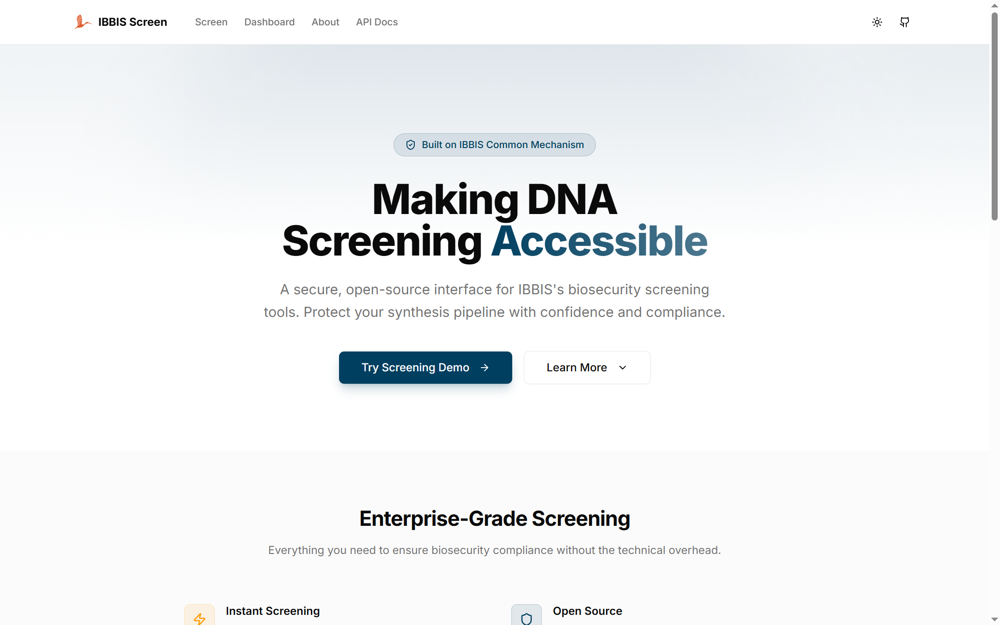
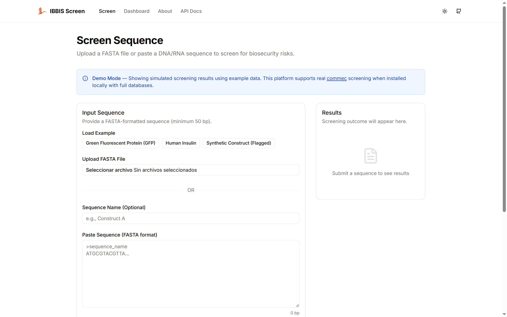

# IBBIS Screen

A web platform that provides an accessible interface for [IBBIS](https://ibbis.bio/)'s open-source DNA/RNA biosecurity screening tools.

**Live Demo:** [ibbis.malvarado.org](https://ibbis.malvarado.org)





---

## The Problem

IBBIS's [Common Mechanism](https://github.com/ibbis-bio/common-mechanism) (`commec`) is a powerful open-source tool for DNA synthesis screening. However, it runs entirely via command line, which limits adoption among synthesis providers, research institutes, and biotech firms that may not have bioinformatics expertise.

## The Solution

IBBIS Screen wraps `commec` in a professional web interface that makes biosecurity screening accessible to non-technical users:

- **Upload or paste** FASTA sequences directly in the browser
- **Visual pipeline** showing each screening step in real-time
- **Clear results** with Pass/Flag/Warning verdicts and region-level detail
- **Downloadable reports** in JSON and HTML formats
- **API-ready** with documented REST endpoints for integration

## Features

| Feature | Description |
|---------|-------------|
| Biorisk Scan | HMM profile matching against curated biorisk databases |
| Low-Concern Check | Clearing sequences against benign protein/RNA/DNA databases |
| Taxonomy Search | BLAST-based organism identification (full installation) |
| Real-time Progress | Step-by-step pipeline visualization |
| Report Generation | Structured JSON and visual HTML reports |
| Dark Mode | Full light/dark theme support |
| Accessible | WCAG AA compliant, keyboard navigable |

## Tech Stack

| Layer | Technology |
|-------|-----------|
| Frontend | Next.js 15, TypeScript, Tailwind CSS v4, shadcn/ui |
| Backend | Python 3.13, FastAPI, Pydantic v2 |
| Screening | commec v1.0.3 (HMMER, BLAST, Infernal) |
| Deployment | Docker, Google Cloud (GCE + Caddy) |

## Getting Started

### Prerequisites

- [Docker](https://docs.docker.com/get-docker/) and Docker Compose (for containerized setup)
- Or: Python 3.11+, Node.js 20+, npm (for local development)

### Option 1: Docker Compose (recommended)

This is the fastest way to get everything running with real commec screening.

```bash
# 1. Clone the repository
git clone https://github.com/malvarado-tech/ibbis-screen.git
cd ibbis-screen

# 2. Build and start both services
#    First build takes ~5 minutes (downloads commec databases, ~236 MB)
docker compose up --build

# 3. Open the app
#    Frontend: http://localhost:3000
#    Backend API: http://localhost:8000/api/v1/health
```

The backend includes commec v1.0.3 with lightweight databases. This enables Steps 1 (Biorisk Scan) and 4 (Low-Concern Check). For full taxonomy screening, see [Full Installation](#full-installation).

### Option 2: Local Development (no Docker)

Without `commec` installed, the backend automatically runs in **mock mode** with simulated screening results. This is useful for working on the frontend or testing the API.

**1. Start the backend:**
```bash
cd backend
pip install -r requirements.txt
uvicorn main:app --reload --host 127.0.0.1 --port 8000
```

**2. Start the frontend** (in a separate terminal):
```bash
cd frontend
npm install
npm run dev
```

**3. Open** [http://localhost:3000](http://localhost:3000)

> The frontend reads `NEXT_PUBLIC_DEMO_MODE` from `.env.local`. Set it to `false` to connect to the backend API, or `true` to use client-side mock data without a backend. See `frontend/.env.example` for all options.

## Full Installation

For complete 4-step screening (including taxonomy search against NCBI databases), you need approximately 700 GB of free disk space.

```bash
# 1. Start the backend container
docker compose up backend

# 2. In another terminal, enter the container
docker exec -it ibbis-screen-backend-1 bash

# 3. Download all NCBI databases (~4-8 hours depending on connection)
commec setup -d /opt/commec/databases

# 4. The databases are stored in a Docker volume and persist across restarts
```

This downloads:

| Database | Size | Used in |
|----------|------|---------|
| `biorisk` + `low_concern` | ~236 MB | Steps 1 and 4 (included by default) |
| `taxonomy` | ~2 GB | Steps 2 and 3 |
| `nr` (NCBI non-redundant protein) | ~350 GB | Step 2 (Protein Taxonomy) |
| `core_nt` (NCBI core nucleotide) | ~250 GB | Step 3 (Nucleotide Taxonomy) |

After downloading, enable full screening by setting the environment variable in `docker-compose.yml`:

```yaml
environment:
  - IBBIS_SKIP_TAXONOMY=false
```

Then restart the services. The platform will automatically run all 4 screening steps.

## Configuration

The backend is configured via environment variables (prefix `IBBIS_`):

| Variable | Default | Description |
|----------|---------|-------------|
| `IBBIS_MOCK_MODE` | Auto-detected | `true` for mock data, `false` for real screening. Auto-detects if `commec` is installed. |
| `IBBIS_SKIP_TAXONOMY` | `true` | Skip Steps 2-3 (taxonomy search). Set to `false` for full screening with NCBI databases. |
| `IBBIS_COMMEC_THREADS` | `2` | Number of CPU threads for commec. Increase for faster screening on multi-core machines. |
| `IBBIS_COMMEC_TIMEOUT` | `300` | Maximum seconds per screening job before timeout. |
| `IBBIS_COMMEC_DB_DIR` | `/opt/commec/databases` | Path to commec databases directory. |
| `IBBIS_COMMEC_CONFIG` | `/opt/commec/config.yaml` | Path to commec YAML config (passed to commec if file exists). |

## Known Limitations

- **Multi-FASTA not supported.** Only single-sequence FASTA input is accepted. Multi-sequence support has been intentionally omitted for this version and may be added in a future release.
- **Lightweight mode by default.** The Docker image includes only biorisk and low-concern databases (~236 MB). Steps 2-3 (taxonomy search) are skipped unless full NCBI databases are installed (~700 GB).
- **In-memory job storage.** Screening results are stored in memory and expire after 1 hour. Not suitable for production workloads without adding persistent storage.

## API

| Method | Endpoint | Description |
|--------|----------|-------------|
| `POST` | `/api/v1/screen` | Submit a FASTA sequence for screening |
| `GET` | `/api/v1/screen/{job_id}` | Poll job status and results |
| `GET` | `/api/v1/screen/{job_id}/report` | Download report (JSON or HTML) |
| `GET` | `/api/v1/examples` | List example sequences |
| `GET` | `/api/v1/health` | Health check |

See the [API Documentation](https://ibbis.malvarado.org/api-docs) for details and code examples.

## Architecture

```
┌─────────────┐     HTTPS      ┌──────────────┐
│   Browser   │ ◄────────────► │   Frontend   │
│             │                │  (Next.js)   │
└─────────────┘                └──────┬───────┘
                                      │ fetch
                               ┌──────▼───────┐
                               │   Backend    │
                               │  (FastAPI)   │
                               └──────┬───────┘
                                      │ subprocess
                               ┌──────▼───────┐
                               │   commec     │
                               │ (HMMER/BLAST)│
                               └──────────────┘
```

- **Frontend** polls the backend every 1.5s after job submission
- **Backend** auto-detects if `commec` is installed; if not, serves mock results for demo purposes
- **commec** runs as a subprocess with `--skip-tx` for lightweight mode

## Project Context

This project was created by [Miguel Alvarado](https://github.com/malvarado-tech) as a demonstration of how IBBIS's screening tools can be made accessible to a broader audience of synthesis providers and research institutions.

Built on [IBBIS Common Mechanism](https://github.com/ibbis-bio/common-mechanism) — an open-source tool by the [International Biosecurity and Biosafety Initiative for Science](https://ibbis.bio/).

## License

Copyright (c) 2026 Miguel Alvarado. All rights reserved. See [LICENSE](LICENSE) for details.
